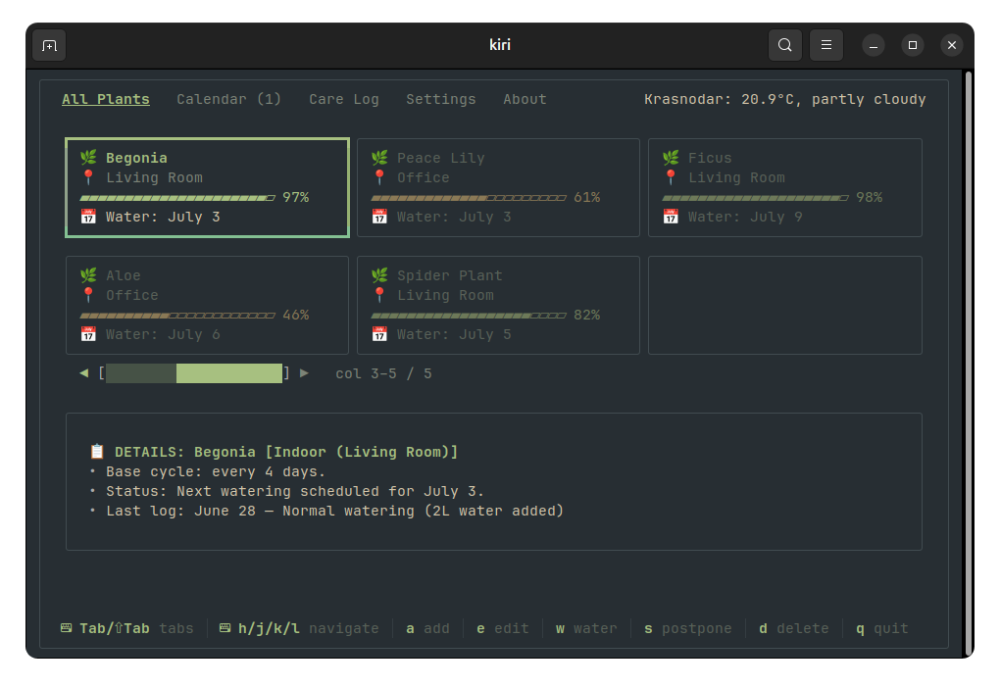

# kiri

[](https://go.dev)
[](LICENSE)
[](#)
[](#)

[English] | [Читать на русском](README.ru.md)

**kiri** is a minimalist, smart, local TUI (Terminal User Interface) companion for tracking your plants' care. It smoothly calculates moisture levels, reminds you when to water, logs your plant care history, and dynamically adjusts to current weather and seasons for outdoor plants.

All data is stored completely locally on your machine in a lightweight SQLite database.


## Main Dashboard

---



## Features

- **Fully Interactive TUI:** Tabbed navigation, card grid with dynamic color coding, monthly calendar task view, and full mouse/keyboard support.
- **Dynamic Hydration Model:** Moisture levels decrease smoothly over time, rather than in sudden daily drops. For outdoor plants, the model factors in seasonal variations, ambient temperature, and precipitation (automatically fetched in the background from the Open-Meteo API).
- **Calendar & History Log:** Plan your watering schedule ahead using the built-in calendar task list and review past actions in a chronological care log.
- **UNIX-way & Scriptability:** Built-in No-TUI flags (`--status`, `--summary`, `--json`) let you output raw plant status or JSON straight into your custom scripts and system bars (`Waybar`, `Polybar`, `i3blocks`, `tmux`).
- **Transparent Mode (**`--transparent`**):** Disables background terminal drawing, allowing the app to seamlessly blend into your custom terminal theme or tiling window manager setup.
- **Lightweight & Self-Contained:** Powered by a fast local SQLite storage. Compiled into a single binary with zero external runtime dependencies.

---


## Quick Start


### Requirements

- **Go 1.22** or higher.
- Any modern terminal emulator (Alacritty, Ghostty, Kitty, GNOME Terminal, etc.).


### Running from Source

```bash
git clone https://github.com/freislot/kiri.git
cd kiri
go run .
```


### Compiling the Binary

```bash
CGO_ENABLED=1 go build -o kiri .
./kiri
```

> **Quick Start Tip:** On its very first run, `kiri` automatically populates the database with **9 demo plants** at various thirst levels. You can instantly test out the interface, charts, and calendar without any manual setup.

---


### Basic Controls

- `Tab` / `Shift+Tab` or `1`-`5` — Switch between tabs
- `↑ / ↓` or `j / k` — Navigate lists
- `Enter` — View plant details
- `q` / `Ctrl+C` — Quit application

---


## Installation


### Pre-compiled Binaries

You can download a standalone binary or a `.deb` package directly from the **[Releases](https://github.com/freislot/kiri/releases)** page.

To install the `.deb` package on Ubuntu/Debian:

```bash
sudo apt install ./kiri_0.1.0_linux_amd64.deb
```

### macOS

> **Note:** Homebrew support will be added in a future release.

If you downloaded the binary archive manually, the operating system automatically applies a quarantine flag to it. To successfully run the utility in your terminal, extract the archive, navigate to the folder containing the file, and remove the security restrictions using the following commands:

```bash
chmod +x ./kiri
xattr -d com.apple.quarantine ./kiri
```

### Arch Linux (AUR)

> **Note:** Official AUR packages (`kiri` / `kiri-bin`) are coming in the next updates. 

For now, Arch users can easily install `kiri` from source via the `go` CLI or the provided `Makefile`. It will automatically integrate with your system path.

### Via Go CLI

```bash
go install github.com/freislot/kiri@latest
```


### Building via Makefile

The project includes a standard GNU Makefile for local installation and maintenance:

```bash
make            # Compile the binary
sudo make install # Install the binary and man page into the system
sudo make uninstall # Completely remove the program from the system
```

---


## CLI Flags

You can use `kiri` as a lightweight script utility without opening the interactive terminal interface. Full help: `kiri -h`


| Flag            | Description                                                                                   |
| --------------- | --------------------------------------------------------------------------------------------- |
| `--version`     | Display version information (`v0.1.0`).                                                       |
| `--status`      | Print a formatted plant status table directly to the console.                                 |
| `--summary`     | Print a single line optimized for status bars (e.g., `💧 3 need watering!` or `🌿 kiri: ok`). |
| `--json`        | Output a full machine-readable JSON dump of all plants for integrations.                      |
| `--transparent` | Force launch the TUI in transparent mode (no background fills).                               |


---


## File Paths & XDG Compliance

The application strictly adheres to the **XDG Base Directory Specification**. Your data stays isolated and safe within your home directory:


| File                   | System Path                                        |
| ---------------------- | -------------------------------------------------- |
| **SQLite Database**    | `~/.config/kiri/data.db`                           |
| **TOML Configuration** | `~/.config/kiri/settings.toml`                     |
| **Backups**            | `~/.config/kiri/data.db.bak` / `settings.toml.bak` |


> **Note:** You can fine-tune drying coefficients, threshold temperatures, rainfall volumes, and seasonal factors inside `settings.toml` while the application is closed. A comprehensive breakdown of the mathematical watering model can be found in the system manual: run `man kiri` after installation.

---


## Documentation

Complete user documentation is available here:

**[User Guide (Russian)](USER_GUIDE.ru.md)**

It contains:

- interface overview
- keyboard shortcuts
- watering model
- weather system
- configuration
- CLI flags
- troubleshooting

---


## Roadmap

- [ ] **Desktop Notifications:** Integrate with native system notification daemons (`notify-send` on Linux, `osascript` on macOS) to trigger desktop alerts when plants are thirsty.
- [ ] **Import/Export Utilities:** Simple backup dumping and restoring (`kiri --import backup.json`).
- [ ] **Official Distribution (Package Managers):**
  - [ ] Create **Homebrew** formulae (`brew install freislot/tap/kiri`) for seamless installation on macOS.
  - [ ] Publish packages to **AUR** (`kiri` / `kiri-bin`) for Arch Linux users.
  - [ ] Set up a personal **APT repository** for Debian/Ubuntu users to allow standard `apt update && apt install kiri` upgrades.
- [ ] **Theming:** Support custom color schemes and built-in theme switching (Gruvbox, Catppuccin, Nord, etc.).
- [ ] **Sync between devices:** Automate secure, encrypted state syncing between home and work machines using a private Git repository or dotfiles manager.
- [ ] **Extensible Plugin System:** Allow users to write custom Go hooks to fetch real-time temperature/humidity from local sensors (instead of a weather API) or trigger smart home hardware (like automated ESP32/Arduino pumps).

---


## License

This project is licensed under the **MIT License**. See the [LICENSE](LICENSE) file for details.  
Third-party library licenses are available in the [THIRD_PARTY_NOTICES](THIRD_PARTY_NOTICES) file.

---


## Author

Pavel Antonov

GitHub: [https://github.com/freislot](https://github.com/freislot)

Email: [freislot@gmail.com](mailto:freislot@gmail.com)
